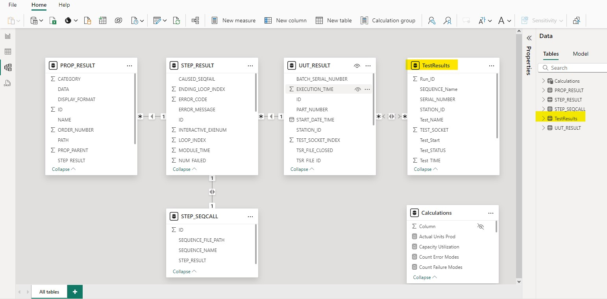

**PURPOSE:** Extract the manufacturing data from TestStand generated Access mdb file. Build a Power BI dashboard app for Test engineers and Mfg managers to uncover process trends and statistical control metrics. Background information on TestStand's native database logger and schema can be found HERE.

1.  **IMPORT AND TRANSFORM DATA**


We create a System DSN using ODBC to connect to the local MS Access database file. Then we use Power BI's native data importer to get the relevant tables needed:
-   PROP_RESULT

-   STEP_RESULT

-   STEP_SEQCALL

-   UUT_RESULT

However, these tables are not useful to Mfg or Test engineers in their current format. We construct a new aggregated table using the folloiwng SQL query:

```
SELECT 
  STEP_SEQCALL.SEQUENCE_FILE_PATH, 
  UUT_RESULT.ID, 
  UUT_RESULT.START_DATE_TIME, 
  UUT_RESULT.STATION_ID, 
  UUT_RESULT.UUT_SERIAL_NUMBER, 
  UUT_RESULT.TEST_SOCKET_INDEX, 
  UUT_RESULT.UUT_STATUS, 
  UUT_RESULT.EXECUTION_TIME, 
  STEP_RESULT.STEP_NAME, 
  ROUND(PROP_RESULT.DATA, 3) 
FROM 
  (
    (
      UUT_RESULT 
      LEFT JOIN STEP_RESULT ON UUT_RESULT.ID = STEP_RESULT.UUT_RESULT
    ) 
    LEFT JOIN PROP_RESULT ON STEP_RESULT.ID = PROP_RESULT.STEP_RESULT
  ) 
  LEFT JOIN STEP_SEQCALL ON STEP_SEQCALL.STEP_RESULT = STEP_RESULT.STEP_PARENT 
WHERE 
  UUT_STATUS <> 'Terminated' 
  and UUT_STATUS <> 'Error' 
  and STATION_ID is not NULL 
  and STEP_RESULT.STEP_TYPE = 'NumericLimitTest' 
  and PROP_RESULT.TYPE_NAME = 'NumericLimitTest' 
ORDER BY 
  START_DATE_TIME, 
  TEST_SOCKET_INDEX, 
  STEP_RESULT.ORDER_NUMBER ASC

```

**NOTE:** The extra parentheses are to make the query compatible with MS Access ODBC driver syntax.

Our final data model is shown below:



2.  **KPI SUMMARY**


**PURPOSE:** Extract the manufacturing data from TestStand generated Access mdb file. Build a Power BI dashboard app for Test engineers and Mfg managers to uncover process trends and statistical control metrics. Background information on TestStand's native database logger and schema can be found HERE.

1.  **IMPORT AND TRANSFORM DATA**


We create a System DSN using ODBC to connect to the local MS Access database file. Then we use Power BI's native data importer to get the relevant tables needed:
-   PROP_RESULT

-   STEP_RESULT

-   STEP_SEQCALL

-   UUT_RESULT

However, these tables are not useful to Mfg or Test engineers in their current format. We construct a new aggregated table using the folloiwng SQL query:

```
SELECT 
  STEP_SEQCALL.SEQUENCE_FILE_PATH, 
  UUT_RESULT.ID, 
  UUT_RESULT.START_DATE_TIME, 
  UUT_RESULT.STATION_ID, 
  UUT_RESULT.UUT_SERIAL_NUMBER, 
  UUT_RESULT.TEST_SOCKET_INDEX, 
  UUT_RESULT.UUT_STATUS, 
  UUT_RESULT.EXECUTION_TIME, 
  STEP_RESULT.STEP_NAME, 
  ROUND(PROP_RESULT.DATA, 3) 
FROM 
  (
    (
      UUT_RESULT 
      LEFT JOIN STEP_RESULT ON UUT_RESULT.ID = STEP_RESULT.UUT_RESULT
    ) 
    LEFT JOIN PROP_RESULT ON STEP_RESULT.ID = PROP_RESULT.STEP_RESULT
  ) 
  LEFT JOIN STEP_SEQCALL ON STEP_SEQCALL.STEP_RESULT = STEP_RESULT.STEP_PARENT 
WHERE 
  UUT_STATUS <> 'Terminated' 
  and UUT_STATUS <> 'Error' 
  and STATION_ID is not NULL 
  and STEP_RESULT.STEP_TYPE = 'NumericLimitTest' 
  and PROP_RESULT.TYPE_NAME = 'NumericLimitTest' 
ORDER BY 
  START_DATE_TIME, 
  TEST_SOCKET_INDEX, 
  STEP_RESULT.ORDER_NUMBER ASC

```

**NOTE:** The extra parentheses are to make the query compatible with MS Access ODBC driver syntax.

Our final data model is shown below:


2.  **KPI SUMMARY**


**Slicers:**
-   Date Range: Filter to show only data from selected day, week, month, or year.

-   Sequence Name: Filters to show only data from selected TestStand test sequence.

-   Test Name: Filters to show only data from selected TestStand test step.
  
**Visuals:**
-   KPI Cards: Displays statistical test metrics for selected test sequence and test step name.

-   Test Data (Selected Name): Displays line chart of Test_Value for selected test sequence/step-name.

-   Data Histogram (Selected Name): Displays histogram of Test Data bins for selected test sequence/step-name.

-   Top Failure Modes: Displays count of "Failed" results for each Test Step Name.

-   Top Error Modes: Displays count of "Error" or "Terminated" results for each Test Step Name.

**Calculations:**
-   ```ThreeSigma = 3*STDEV.P(TestResults[Test_Value])```
-   ```LowerControlLimit = AVERAGE(TestResults[Test_Value])-[ThreeSigma]```
-   ```UpperControlLimit = AVERAGE(TestResults[Test_Value])+[ThreeSigma]```
```
Count Failure Modes = 
    COUNTROWS(
        FILTER(
            STEP_RESULT,
            [STATUS] = "Failed"
        )
    )
```
```
Count Error Modes = 
    COUNTROWS(
        FILTER(
            STEP_RESULT,
            [STATUS] = "Error" || [STATUS] = "Terminated"
        )
    )
```

3.  **MFG CAPACITY**


**Slicers:**
-   Date Range: Filter to show only data from selected day, week, month, or year.

-   Sequence Name: Filters to show only data from selected TestStand test sequence.
  
**Visuals:**
-   KPI Cards: Displays statistical process metrics for selected test sequences.

-   Test Time (Selected Sequence): Displays line chart of Median_Test_Time for selected test sequence.

-   Time Histogram (Selected Name): Displays histogram of Test Time bins for selected test sequence.

-   Total Units Produced per Day: Displays vertical bar chart of how many distinct units were produced each day for each test sequence.

-   Total Units by Sequence: Displays horizontal bar chart of how many distinct units were produced over the entire date range for each test sequence.

**Calculations:**
***
*PRODUCTION CAPACITY*
```
MFG Period = 
VAR _max =
    MAXX ( ALLSELECTED ( 'TestResults' ), 'TestResults'[Test_Start] )
VAR _min =
    MINX ( ALLSELECTED ( 'TestResults' ), TestResults[Test_Start] )
RETURN
    DATEDIFF ( _min, _max, DAY ) + 1
```
```
Potential Units Prod = 
    [MFG Period]                                // # of Days in slicer
    * 2                                         // # of shifts in a day
    * 7                                         // # of work hours in a shift
    * 3600                                      // # of seconds in an hour
    / ( MEDIAN(TestResults[Test_TIME]) + 120 )  // divide by Average-Test-Time (including 2 minutes to swich over)
```
-   ```Actual Units Prod = DISTINCTCOUNT(UUT_RESULT[UUT_SERIAL_NUMBER])```
-   ```Capacity Utilization = [Actual Units Prod] / [Potential Units Prod]```
***
*PRODUCTION YIELDS*
```
Total Yield = 
// Calculate all unique serial numbers (excluding dummy SN's with digits != 7)
VAR distinctCountTotal =
    CALCULATE (
        DISTINCTCOUNT ( UUT_RESULT[UUT_SERIAL_NUMBER] ),
        LEN ( UUT_RESULT[UUT_SERIAL_NUMBER] ) = 7
    )
RETURN distinctCountTotal
```
```
Total Pass = 
VAR distinctCountPass =
    CALCULATE (
        DISTINCTCOUNT ( UUT_RESULT[UUT_SERIAL_NUMBER] ),
        LEN ( UUT_RESULT[UUT_SERIAL_NUMBER] ) = 7,
        UUT_RESULT[UUT_STATUS] = "Passed"
    )
RETURN distinctCountPass
```

-   ```Total Scrap = [Total Yield] - [Total Pass]```
```
Total Fail = 
// Calculate unique serial numbers of failed products (excluding dummy SN's with digits != 7)
VAR distinctCountFail =
    CALCULATE (
        DISTINCTCOUNT ( UUT_RESULT[UUT_SERIAL_NUMBER] ),
        LEN ( UUT_RESULT[UUT_SERIAL_NUMBER] ) = 7,
        UUT_RESULT[UUT_STATUS] = "Failed"
    )
RETURN distinctCountFail
```
-   ```First Pass Count = [Total Yield] - [Total Fail]```
-   ```First Pass Yield = DIVIDE([First Pass Count], [Total Yield])```

-   ```Throughput Yield =     DIVIDE ( [Total Pass], [Total Yield] )```

-   ```Scrap Rate = DIVIDE([Total Scrap], [Total Pass])```


** Slicers:**
-   Date Range: Filter to show only data from selected day, week, month, or year.

-   Sequence Name: Filters to show only data from selected TestStand test sequence.

-   Test Name: Filters to show only data from selected TestStand test step.
  
** Visuals:**
-   KPI Cards: Displays statistical metrics for selected test sequence and test step name.

-   Test Data (Selected Name): Displays line chart of Test_Value for selected test sequence/step-name.

-   Data Histogram (Selected Name): Displays histogram of Test Data bins for selected test sequence/step-name.

3.  **MFG CAPACITY**


We found several issues in the report upon exploring the data:

-   First, the primary metric (Percent Customers Returned within 90 Days
    of **FIRST** Purchase) did not actually have any positive hits for
    the first two years. For 2001 and 2002, none of the customers
    purchased again the same year, let alone the same quarter.

    -   

    -   

> **Corrective Action:** After sharing and discussing this finding with
> the client, it was decided to update the metrics to a more generic
> calculation of monthly customers and the count and percentage who
> returned within 90 days (inclusive) and within 3 months (exclusive) of
> any given monthly purchase. So instead of counting repeat customers
> from their **First month**, we count repeat customers for **Each
> month.**
```
90D_Repeat_Customer_Cnt = 

/* Capture Distinct CustomerKeys per row-context (month of year) */
VAR CustomerList = VALUES( Sales[CustomerKey] )                             

/* Add up items-per-invoice and invoice per customer so all "lines" are weighted to add up to 1 */
VAR CustomerMonthlyOrderCount =                                             
    CALCULATE(  
        COUNTROWS(Sales)                                                    // Count number of sales rows
        , ALLEXCEPT(Sales, Sales[CustomerYearMonth])                        // associated with each unique combination of CustomerKey & OrderYearMonth
    )  

/* Determine if this purchase was followed up by another within 90 days (1 means yes) */
VAR RepeatCustomerFlag =                                                    
    COUNTROWS(                                                              // Count number of rows
        FILTER(                                                             // where we filter
            CustomerList,                                                   // Distinct CustomerKeys
            CALCULATE(                                                      // and calculate
                COUNTROWS(Sales),                                           // the number of sales rows
                FILTER(                                                     // where we filter
                    ALLSELECTED('Sales'),                                   // AllSelected rows in Sales table
                    'Sales'[OrderDate] > MIN('Sales'[OrderDate])            // such that current-row-OrderDate is > minimum-date (exclusive)
                    && 'Sales'[OrderDate] <= MIN('Sales'[OrderDate]) + 90   // and current-row-OrderDate is >= minimum-date-right-shifted-90-days (inclusive)
                )
            )
        )
    )

/* Calculate contribution of each partial-invoice by dividing RepeatFlag (0 or 1) by InvoiceCount; 2 becomes 0.5, 4 becomes 0.25, etc... */
VAR RepeatCustomerCount = DIVIDE(RepeatCustomerFlag, CustomerMonthlyOrderCount, 0)       

RETURN
    RepeatCustomerCount
```
> For the 3 month calculation we use this modified measure:
```
3M_Repeat_Customer_Cnt = 

/* Capture Distinct CustomerKeys per row-context (month of year) */
VAR CustomerList = VALUES( Sales[CustomerKey] )                             

/* Add up items-per-invoice and invoice per customer so all "lines" are weighted to add up to 1 */
VAR CustomerMonthlyOrderCount =                                             
    CALCULATE(  
        COUNTROWS(Sales)                                                        // Count number of sales rows
        , ALLEXCEPT(Sales, Sales[CustomerYearMonth])                            // associated with each unique combination of CustomerKey & OrderYearMonth
    )  

/* Determine if this purchase was followed up by another within 3 months (1 means yes) */
VAR RepeatCustomerFlag =                                                    
    COUNTROWS(                                                                  // Count number of rows
        FILTER(                                                                 // where we filter
            CustomerList,                                                       // Distinct CustomerKeys
            CALCULATE(                                                          // and calculate
                COUNTROWS(Sales),                                               // the number of sales rows
                FILTER(                                                         // where we filter
                    ALLSELECTED('Sales'),                                       // AllSelected rows in Sales table
                    'Sales'[OrderDate] > EOMONTH(MIN(Sales[OrderDate]), 0 )     // such that current-row-OrderDate is > minimum-date-end-of-month (exclusive)
                    && 'Sales'[OrderDate] <= EOMONTH(MIN(Sales[OrderDate]), 3 ) // and is <= minimum-date-end-of-month-right-shifted-3-months (inclusive)
                )
            ) > 0                                                               // where # of sales is greater than zero
        )
    )

/* Calculate contribution of each partial-invoice by dividing RepeatFlag (0 or 1) by InvoiceCount; 2 becomes 0.5, 4 becomes 0.25, etc... */
VAR RepeatCustomerCount = DIVIDE(RepeatCustomerFlag, CustomerMonthlyOrderCount, 0)       

RETURN
    RepeatCustomerCount
```
>
> **Because of this, the updated report shows no repeat customers in
> 2001 and 2002:**


-   Secondly, the updated calculations for 90D and 3M repeat customers
    show that quarterly repeat customers did not occur until April 2003:


-   Finally, to make a comparison with the quarterly metrics, we added a
    Lifetime (LT) Repeat Customer metric to see if a customer in any
    given month or year purchased again (without and upper time limit):


